========================
Accreditation Management
========================
The accreditation section of the software was designed to help store, collect and report evidence
of achievement of a programme's Student Learning Outcomes (**SLO**, somtimes termed **Graduate Attributes**) 
and Programme Educational Objectives (**PEO**). 
It is possible to track achievement of SLO and PEO for all programmes offered by a given Department.
It is also possoble to track achievemnt of the individual courses learning outcomes (**CLO**).

The main purpose of the accreditation section of the sotware is to **automatically generate**
a report of the achievement of the SLO, which is often required in accreditation exercises.

At the top of the accreditation page, one can select the relevant cohorts and whether
to include only compulsory courses

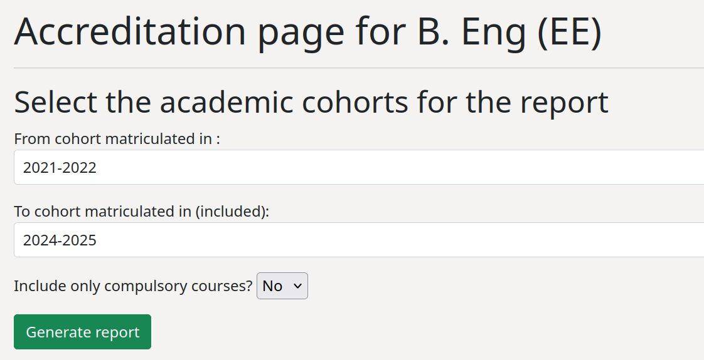

Upon clicking the "Generate report" button, the sofware queries the 
database, looking at all relevant courses, surveys and measures (see below for more details). 
It only looks at courses that were actually offered in that particular year, 
by figuring out whether any lecturer was assigned
to teach that course for that year (see Workload section). 
It also discriminates SLO and CLO by the years of their validity.

The report has several sections. First is an overall overview of the mapping and their strength.

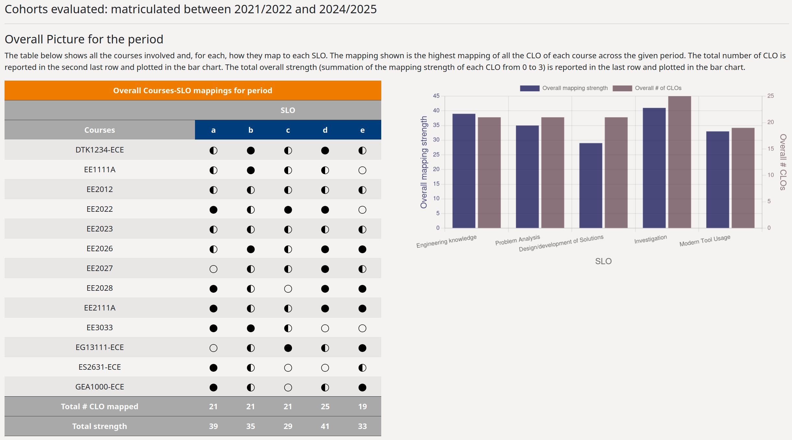

The popular half-moon/full-moon table is shown. The table below shows  all the courses involved and, for each, 
how they map to each SLO.

* Full moon: 3
* Half moon: 1 or 2
* Empty moon: 0 
 
The mapping shown is the highest mapping of all the CLO of each course across the given period. 
The total number of CLO is reported in the second last row and plotted in the bar chart. 
The total overall strength (summation of the mapping strength of each CLO from 0 to 3) 
is reported in the last row and plotted in the bar chart. 

Next is an overall table of how much **"attention"** each SLO received. 
Such table shows, for each SLO, how much "attention" they received over the years. "Attention" takes the form of 

* Survey questions targeting the SLO, named "SLO survey measures". Attention from SLO surveys is computed by adding up the number of questions every year.
* Survey questiins that target a CLO that is mapped to the SLO, named "CLO survey measures".  If the mapping strength is 3 (maximum), then the attention score is increased by 1 - and scaled accoridngly for partial mapping. 
* Direct measures of performance. These are assessment questions scores of a course targeted at a CLO that is mapped to the SLO. If the mapping strength is 3 (maximum), then the attention score is increased by 1 - and scaled accoridngly for partial mapping. 

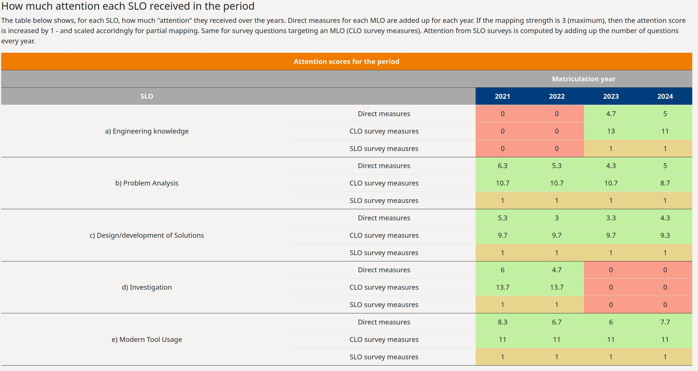

Finally, for each SLO, detailed information are reported. The figure below shows an example for one SLO.

* A table with all contributing courses, and their mapping (highest among the CLOs) for each year.
* A summary of all the SLO survey measures, with details of the survey question and the average score.
* A summary of all the CLO direct measures. 
* A summary of all the CLO survey measures, provided the CLO was mapped to the SLO.

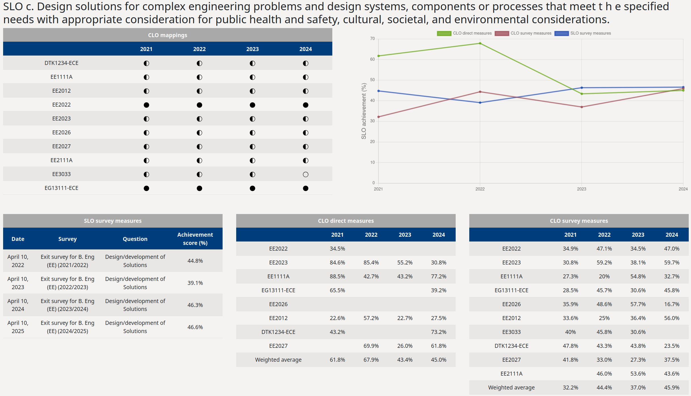

------------------------
The main Department page
------------------------
The Department main page includes 3 tables. One with a summary of all acasdemic programmes offered by the 
Department, inclduing sub-programmes such as specializations or minors. Each programme includes a button that
links directly to the accreditation page.   

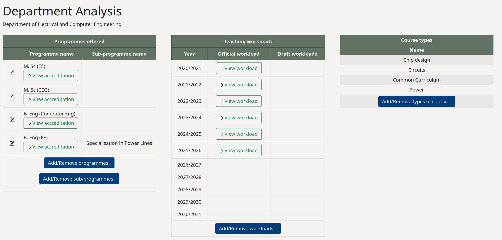

The second table summarizes all the teaching workloads (both official and draft) with direct links to each, and
the ability to add and remove workloads. Finally, there is a table to set the type of courses that appear 
in the workload management page.

--------------------------------
The programme accreditation page
--------------------------------
.. _programme-page-label:

The accreditation page includes

* Tables with SLO and PEO, including buttons to crate new ones, edit existing ones, including their **time validity** as shown in the figure below

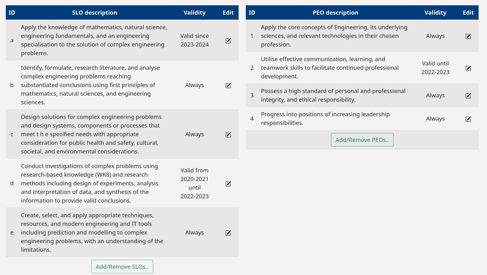

* Table with mapping between PEO and SLO. The mapping strength is indicated.

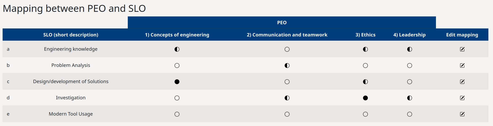

* A summary table with all the existing surveys for SLO and PEO. This includes abaility to input survey results, view them, and store an original file for the survey 

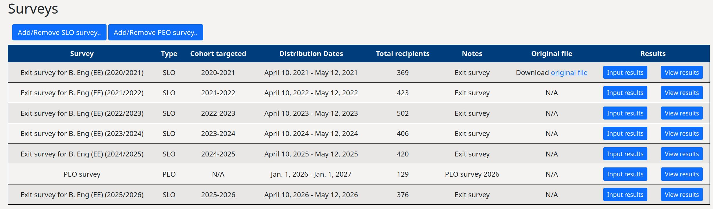

* A table with the settings for all the programme surveys (SLO, PEO and CLO) allowing for customized survey settings for different types of surveys.
  This includes the ability to edit the labels of the survey. The software supports surveys with up to 10 labels.

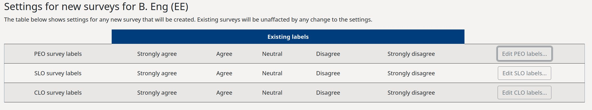

--------------------------
The individual course page
--------------------------
Each course has its own separate page whoch contains accreditation information as well as workload information.
For accreditation, the following are visualized

* A table showing the mapping between the programme SLO and the course CLO, with ability to add and remove CLO,
  and edit existing mapping. One suhc table is present for each programme the course is included in. 
  The mapping strength is indicated as follows
 
   * Full moon: 3
   * Half moon: 1 or 2
   * Empty moon: 0 

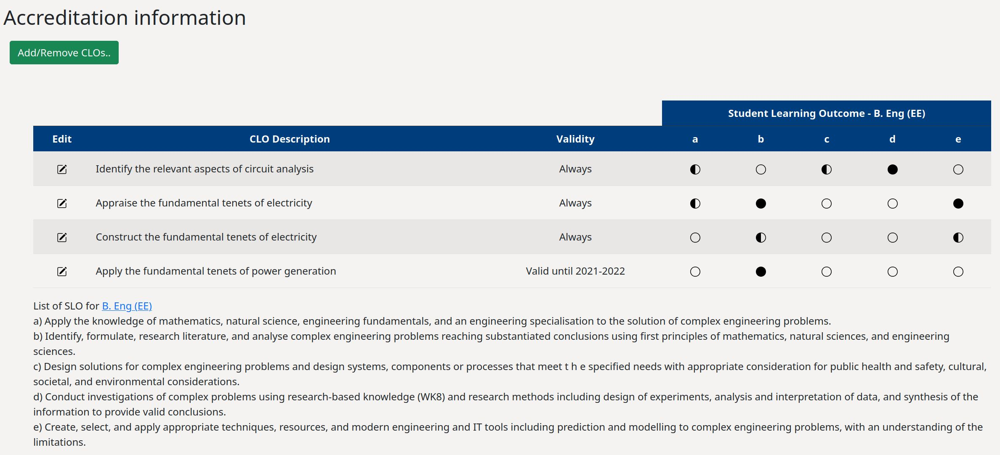

* Measure of achievement of the CLO divided in
   * Survey measures. Unlimited number of surveys can be added, each with ability to upload and store a file with raw results.
   * Direct measures. In accreditation parlance, this refers to direct performance measures. For example, if 
     exam questions 1, 2 and 4 target CLO #1, then the average score of question 1, 2, and 4 is taken as a
     direct measure of achievement of CLO #1. Unlimited number of direct measures can be stored, 
     each tagged to an academic year.
   * Reflections for improvement. This is a smiple table to store the measures taken by the lecturer to improve 
     after recording poor achievement of CLO. This is important to document a **closed loop of continuous improvement**
     for accreditation purposes.

-------------------
Handling of surveys
-------------------
The software is deisgned to store and visualize survey results. Spcifically, one can specify a survey to be
targeting SLO, PEO, or CLO. The labels (Strongly agree, agree, etc) are specified at  :ref:`programme level <programme-page-label>` level.  

Creation of new surveys happen in two steps. First, the survey is created with title, period of distribution, 
intended target and some notes. The second step is to input results. The figure below shows 
an example of an SLO survey input page, where each question is mapped to an SLO (chosen from a drop-down list).
Question title and number of respondents with a given resonse can be input. 

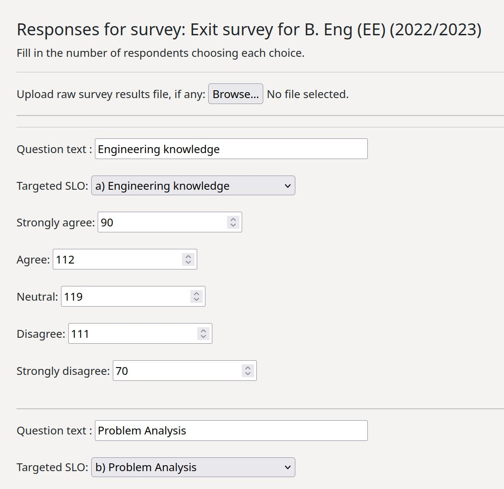

There is also a psossibility to upload a file, intended, for example, as the original raw file 
exported from one of the various survey platforms. This may be important for auduting purposes.

It is also possible to view survey results with various metrics and charts provided by the software.
Overall summary results are displayed

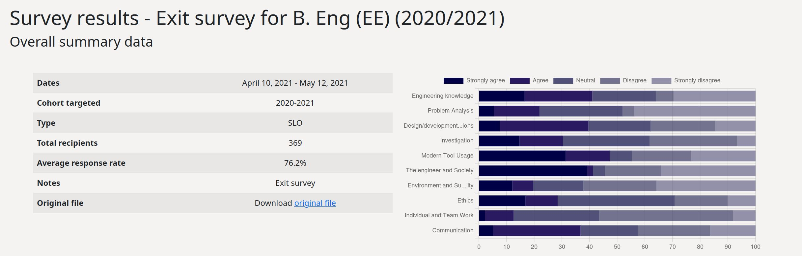

And results for each individual questions below

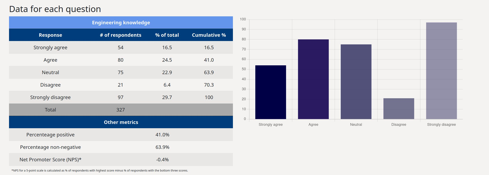

