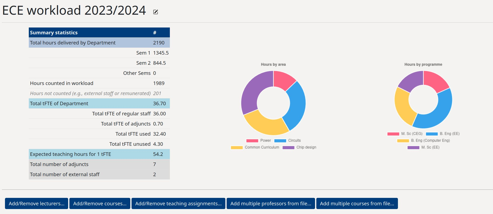
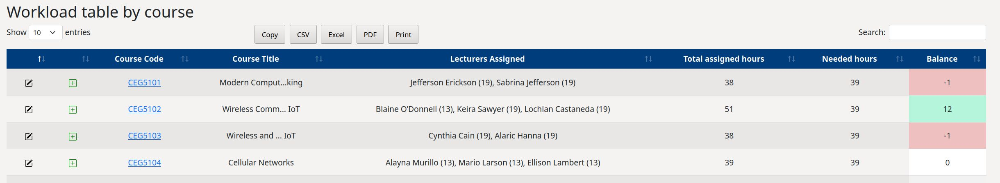

===================================
Workload Management
===================================

------------
Key concepts
------------
Workload management is based on a series of **teaching assignments** for a given academic year. 
Each teaching assignment is made of a lecturer, a course, and a number of hours assigned.
In the example below, the lecturer Lionel Duffy is assigned to teach the course ME3123. 
The **teaching assignment type** can be selected from the drop-down list.
The types of teaching assignments that appear in teh drop-down list are set by the faculty (see below). 
In the example, Lionel Duffy is assigned to teach 3 groups of students for a design project. 
Each group counts for 13 hours (set by the faculty).

.. image:: ../images/add_assignment.gif
   :alt: Adding a teaching assignment
   :width: 80%

After this operation, Lionel Duffy willl be loaded with 39 hours (13X3). 

.. image:: ../images/workload_table.png
   :alt: Sample workload table
   :width: 100%

The **workload scenario** page contains a table where each row is a lecturer, and for each lecturer

* The name of the lecturer
* The lectrer teaching Full TIme Equivalent (see `The concept of tFTE`_ below)
* The list of teaching assignments (with hours in brackets). Assignments in grey are not counted towards the workload.
* The total hours assigned
* The expected hours (see `The calculation of expected workload`_ below)
* The balance (hours aasssigned - expected hours). 
  This cell is coloured automatically in green if the balance is :math:`\geq 15`, red if :math:`\leq 15` and white otherwise.

Each Department can have as many workload scenarios as wanted. 
Workload scenarios can be created, copied and modified over unlimited number of years. 

-------------------
The concept of tFTE
-------------------

Workload computation is based on the concept of **teaching Full Time Equivalent** (tFTE). It is calculated as follows

.. math::

   tFTE = T_{adj}*R_{adj}*FTE

where 

  * :math:`FTE` is the Full-Time equivalent of the staff with the Department (1.0 if fully employed by the Department)
  * :math:`T_{adj}` is the adjustment due to possible different employment tracks (e.g., this could be 2.0 for educator track to signal a need for double workload)
  * :math:`R_{adj}` is the adjustment due to any possible service role that entitles the staff to teaching discounts (e.g., this could be 0 or 0.1 to lighten the load of heads of departments).

------------------------------------
The calculation of expected workload
------------------------------------

The software is based on the principle of **fair distribution of workload**. Let :math:`TOT` be the total number of teaching hours assigned by the Department in a given scenario

.. math::

   TOT = \sum_{i=1}^{N} t_{i}

where :math:`t_{i}` is the number of hours for each of the :math:`N` teaching assignments. In the example above, one of these :math:`t_{i}` would be 39. We then define :math:`Dept_{tFTE}`
as the summation of all the :math:`tFTE` of all the individual lecturers of the Department for that year

.. math::
   Dept_{tFTE} = \sum_{i=1}^{n} tFTE_{i}

where :math:`tFTE_{i}` is the :math:`tFTE` of each inidvidual lecturer of the :math:`n` lecturers in the Department for that year. Under the principle of 
fair distributioin of workload, :math:`TOT` hours should be spread equally among the Department staff. Each unitary :math:`tFTE` is therefore expected 
to teach :math:`E` hours, where 

.. math::
   E = \frac{TOT}{Dept_{tFTE}}

As such, each individual lecturer :math:`i` is expected to teach

.. math::
   E_{i} = E*tFTE_{i}

The number :math:`E_{i}` is calculated and reported in the workload table and labelled as **Expected hours** 
for each lecturer

--------------------------
The workload scenario page
--------------------------

At the top of the workload scenario page, a summary view is presented with a summary table and charts.

The table contains some summary statistics of the teaching assignments. One important line is the one 
labelled **Expected teaching hours for 1 tFTE** which is obtained by dividing the total hours assigned 
by the total tFTE of the Department for that year.

The first of the two charts is a pie chart showing the assigned hours accoridng to the **course type**. 
The types of courses available are set by the Department.

The second chart is also a pie chart showing the assigned hours by programme. Each course can belong
to one (or more) programmes. This chart provides an overview of which programme the Department is investing more
teaching resources. 

The **workload scenario** page contains the summary oragnized by lecturer , 
as explained above under `Key concepts`_ . It also contains a table where each row is a course, and for each course

* The course code 
* The course title
* All the lecturers assigned to that course with, in brackets, the number of hours
* The hours needed by each course
* The balance between assigned and needed (automatically coloured).

The two tables share the same information, but presented differently, one by lecturer and one by course. 

